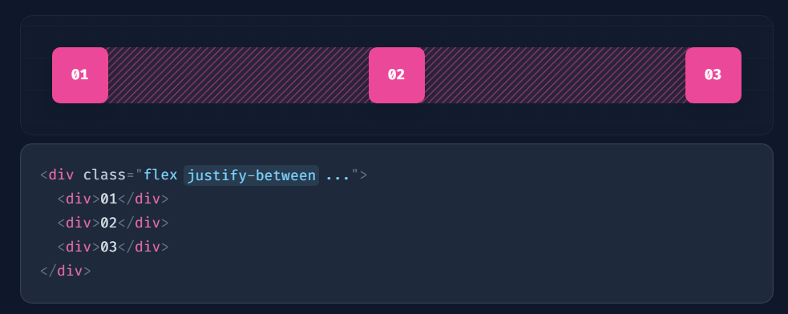
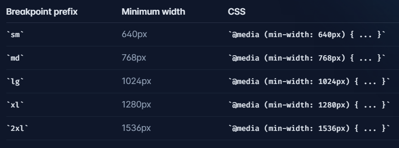

## Create Project

```
npx create-react-app app-name

npm start
```

<br>

Install tailwind

```
npm install -D tailwindcss
npx tailwindcss init

```

[Install Tailwind CSS with Create React App](https://tailwindcss.com/docs/guides/create-react-app)

<br>

Install React Icons

```
npm add react-icons
```

<br>

## Navbar (9:50 - 32:50

)

Result:


<br>

---

Use justify-between:



Responsive Design


xl: computer

lg, md: pad

sm: phone

<br>

Flex Container properties:

```css
container {
  display: flex;
  flex-direction: row/column;
  justify-content: center/space-between;
  align-items: center/baseline;
}
```
