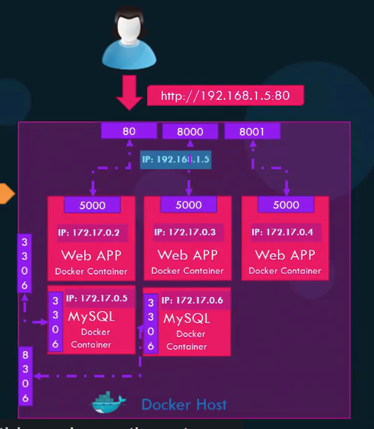

## Docker Run

### Docker Tag

docker run redis

- pull the latest image and run the container

docker run redis:4.0

- pull a specific version, it's called 'tag'

### RUN - STDIN

By default the Docker container does not listen to a standard input.

docker run -it kodekloud/simple-prompt-docker

- using '-i' to enable interactive mode to listen to input
- '-t' stands for pseudo terminal, it shows the prompt of the container

### Run - PORT mapping

docker host: the underlying host where Docker is installed. Also named Docker engine.

Internal IP: Every docker container gets an IP assigned by default, which is called internal IP. It's only accessible within the Docker host.

docker run -p 80:5000 kodekloud/webapp

- map port 80 of localhost to port 5000 on the docker container

### RUN - Volume mapping

docker run -v /opt/datadir:/var/lib/mysql mysql

- mount the external directory(/opt/datadir) to a folder inside the Docker container
- if you delete the docker container, the data still remains

### Inspect Container

docker inspect blissful_hopper

- return all details of a container in a JSON format, including its private ip address

### Container Logs

docker logs blissful_hopper

- view the logs

 

## Advanced Docker Run Features

docker run ubuntu:17.10 cat /etc/_release_

- run the container of the image ubuntu with the tag
- the cat command print out the version of ubuntu

docker run -d timer

docker attatch timer

- run container of the timer image in detatch mode, then go back to the console

 

docker inspect container-name
