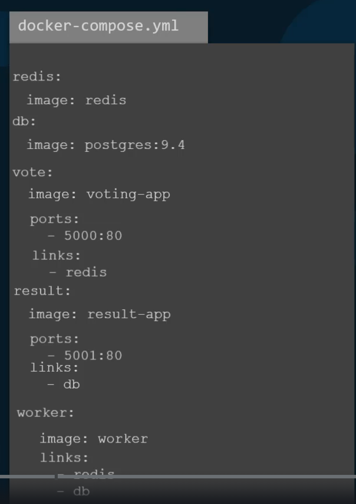
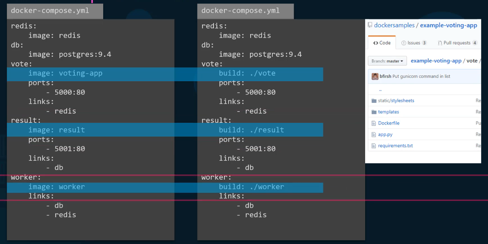

## Docker Compose

Firtst, let’s use docker run command to run containers

docker run -d - -name redis redis

docker run -d - -name db postgres

docker run -d - -name=vote -p 5000:80 voting-app

docker run -d - -name=result -p 5001:80 result-app

docker run -d - -name=worker worker

 

In order to make the voting-app aware of the Redis service:

docker run -d - -name=vote -p 5000:80 - -link redis:redis voting-app

- The first ‘redis’ is the redis container’s name
- In source code of voting-app, it’s looking for the ‘redis’ host. So the second ‘redis’ is the name of host the voting-app is looking for.

Similar to result-app:

docker run -d --name=result -p 5001:80 - -link db:db result-app

 

Finally, the worker application requires access to both:

docker run -d --name=worker --link db:db --link redis:redis worker

 

Convert these commands to docker-compose.yml

 

What if I want to use my own applications rather than official images from Docker Hub?

 

---

Differnent Versions of Docker Compose file

- version 1, 2, 3
- we will see version 3 (comes with support for Docker Swarm) in more details

## Example Voting Application

build images for applications (vote, result, worker)

~/Desktop/example-voting-app/vote

- docker build . -t voting-app
- docker run -d --name redis redis
- docker run -d --name voting-app -p 5000:80 --link redis:redis voting-app
- docker run -d --name db postgres:15-alpine

    

~/Desktop/example-voting-app/worker

- docker build . -t worker-app
- docker run -d --link redis:redis --link db:db worker-app

    

~/Desktop/example-voting-app/result

- docker build . -t result-app
- docker run -d -p 5001:80 --link db:db result-app

 

The reason both containers are assigned port 80 inside the container is that they are probably expecting incoming HTTP requests on that port by default.
