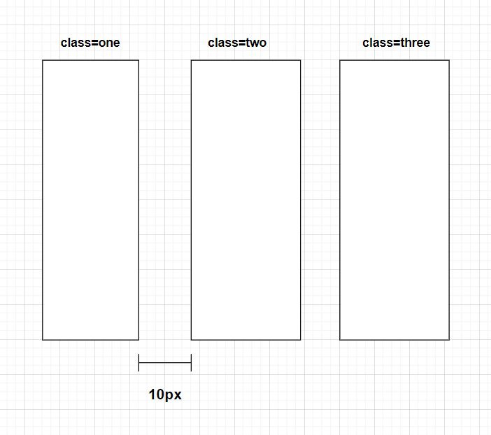

## Display:Flex

```
<div class="container">
  <div class="one"><p>...</p></div>
  <div class="two"><p>...</p></div>
  <div class="three"><p>...</p></div>
</div>

.container {
  display: flex;
  gap: 10px;
}
```

results:


Two axises of flexbox:

- They change when flex-direction is set to row(default) or column
  

## Flex Direction

- flex-direction by default is set to row. main axis is horizontal.
- if flex-direction is column, elements will line-up from top to bottom. main axis changed.

```
.container {
    display: flex/inline-flex;
    flex-direction:column/row;
}

.container > * {
    flex-basis: 100px;
}
```

<br>

## Flex Layout

```html
order:0
```

- child element property
- by default, it's 0

```html
flex-wrap: nowrap/wrap;
```

- parent container property
- by default, it's nowrap

```html
justify-content: flex-start/flex-end/center/space-between
```

- parent container element
- by default it's flex-start (space is in the ending)
- **set distribution along the main axis**

```
align-items: flex-start/flex-end/center;
height: 70vh; (viewport height, 70% of the window)
```

- parent container element
- **set distribution along the cross axis**
- will only work if flex-wrap is set to nowrap

```html
align-self: flex-start;
```

- element property
- make the item independant from the group.

```
flex-wrap: wrap;
align-content: center;
height: 70vh;
```

- similar to align-items, but only work when flex-wrap is set to wrap.
- when elements go to next line, it will look align-content to see how it's spaced.

[Appbrewery Example website](https://appbrewery.github.io/flex-layout/)

[Flex Box Cheatsheet](https://css-tricks.com/snippets/css/a-guide-to-flexbox/)

</br>

## Flex Sizing

<br>

### Order of Priority of how to change size of elemnts

- Content width < Width < flex-basis < min-width/max-width

```
min-width = 30px;
```

when windows shink, elements will also shrink until reach the min-width (default)

```
max-width = 300px;
```

How wild the element can possiblely be

```
width = 30px;
```

set initial element width to 100px, but it will still shink when there is not enough space.

```
flex-basis: 200px;
```

specify the initial size of a flex item along the main axis

### Grow and Shrink

```
flex-basis: 100px;
flex-grow: 0;
flex-shrink: 0;
```

- elements property, not container property
- elements stay the same size when windows change
- The default value of flex-grow is 0, which means the flex item will not grow and will maintain its initial size based on the flex-basis value.

```
flex-basis: 100px;
flex-grow: 1;
flex-shrink: 0;
```

- flex items will grow and occupy all available space along the main axis.

```
flex-basis: 100px;
flex-grow: 0;
flex-shrink: 1;
```

- default, not grow, but it's going to shrink (until the min-width, which is content width by default)

```
flex-basis: 100px;
flex-grow: 1;
flex-shrink: 1;
```

- it will expand as much as possible and when you shrink it will be as small as possible.
- flex-basis is actually not working

```
flex-basis: auto; (default)
flex-grow: 1;
flex-shrink: 1;
```

- default flex-basis gives space based on the content of items.
- change it to 0 so every flex item is equal

```
flex: 1 1 0;
```

- shorthand (grow value basis)
- can be further shortened as flex: 1

<br>

```
Flex Container {
  display: flex;
  gap: 10px;
}

Red Flex Item {
  flex: 1;
}

Blue Flex Item {
  flex: 2;
}

Green Flex Item {
  flex: 3;
}
```

- set ratio for elements
