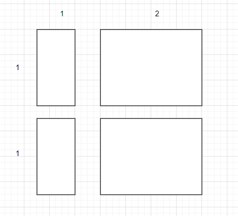
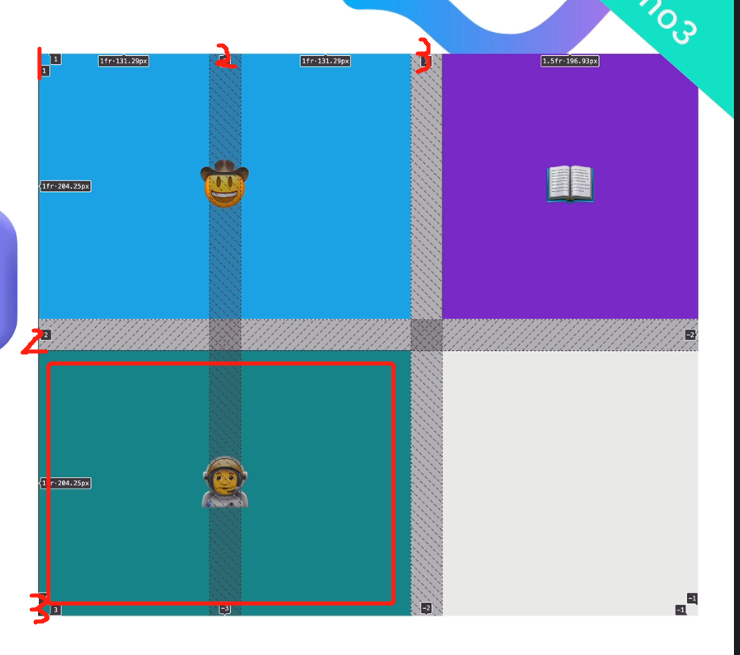

## Grid and Flexbox

```
<div class="container">
    <p>...</p>
    <p>...</p>
    <p>...</p>
    <p>...</p>
</div>

.container {
    display: grid;
    grid-template-columns: 1fr 2fr;
    grid-template-rows: 1fr 1fr;
    gap: 10px;
}
```

grid-template-columns: 1fr 2fr;

- There are two columns and the width ratio is 1:2
  

Project:

- &lt;div&gt; automatically takes up a whole line since its block property is "block"

## Grid Sizing

```
<div class="grid-container">
    <div class="grid-item"> 1 </div>
    <div class="grid-item"> 2 </div>
    <div class="grid-item"> 3 </div>
    <div class="grid-item"> 4 </div>
</div>
```

```
.grid-container {
    display: grid;
    grid-template-rows: 100px 200px;
    grid-template-columns: 400px 800px;
}
```

- not responsive for screen size (even use rem, which based on root html element)

<br>

```
.grid-container {
    display: grid;
    grid-template-rows: 100px auto;
    grid-template-columns: 200px auto;
}
```

- columns: the second column will expand when screen size changes
- rows: size of the second row is based on content size

<br>

```
.grid-container {
    display: grid;
    grid-template-rows: 200px 400px;
    grid-template-columns: 200px minmax(400px, 800px);
}
```

- the second column can go all the way up to 800px, and can shrink to 400px

<br>

```
grid-template-rows: repeat(2, 200px);
```

- grid-template-rows: 200px 200px;

<br>

```
grid-auto-rows: 300px;
```

- specify the height of rows that are more than defined rows in the grid container

[Appbrewery website](https://appbrewery.github.io/grid-sizing/)

<br>

## Grid Placement

Grid  
line  
Tracks  
Cells  
Container  
item (grid item must have the class "item")

```
grid item selector {
    grid-column: span 2;
}
```

- the item takes two cells horizontally
- short form for:

```
grid item selector {
    grid-column-start: track number;
    grid-column-end: track number;
}
```

- track number starts from 1
- can also be -1, which means the last track

```
grid item selector {
    order: 0/1;
}
```

- similar to flexbox, default number is 0
- start from the first cell, then the cell on its right until the next line

```
grid item selector {
    grid-column-start: 1;
    grid-column-end: 3;
    grid-row-start: 2;
    grid-row-end: 3;
}
```

- give the exact coordinate -> can be shortened as **grid-area: 2 / 1 / 3 / 3**
- other items should also use grid area
  
