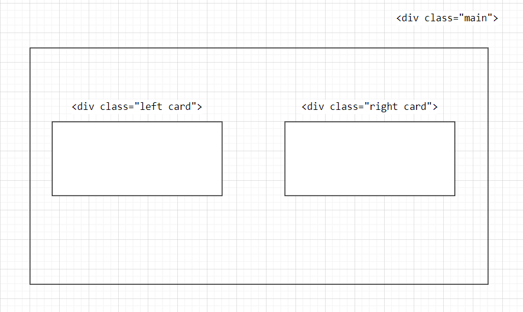

# Contents

## How to add CSS

Inline

```html
<html style="background: blue"></html>
```

Internal

```html
<html>
  <head>
    <style>
      html {
        background: red;
      }
    </style>
  </head>
</html>
```

External

```html
<html>
  <head>
    <link rel="stylesheet" href="./styles.css" />
  </head>
</html>
```

- rel: relationship
- href: location

## CSS selectors

Element Selector

```html
h1 { color: blue; }
```

Class Selector

```html
.red-heading { color:red; }
```

ID Selector

```html
#main { color: red; }
```

Attribute Selector

```html
p[draggable] { color: red; }
```

- select all &lt;p&gt; elements with the attribute draggable

Everyhing Selector

```html
* { color: red; }
```

## CSS Properties

[named colors](https://developer.mozilla.org/en-US/docs/Web/CSS/named-color)

[color palettes for designers](https://colorhunt.co/)

Font Properties

- 1px = 0.26mm, 1/96th inch
- 1pt = 0.35mm, 1/72nd inch
- 1em: 100% of parent
- 1rem: 100% of root (usually the html element) -> Recommended

Font Weight

```html
h1 { font-weight: bold/normal }
```

- font-weight: lighter/bolder (Relative to Parent)
- font-weight: 100-900

Font Family

```html
#arial { font-family: Arial, sans-serif; }
```

- if the user's computer does not have Arial font, use sans-serif

[Google Font Family](https://fonts.google.com/)

Text Align

```html
text-align: start/end/left/right;
```

CSS Box Model

**Border Properties**

```html
border: 10px solid black
```

- 10px: thickness
- solid: border style
- black: border color

```html
border-top: 0px; border-width: 0px 10px 20px 30px; border-width: 10px, 20px
```

- Four values of border-width: top, right, bottom, left
- Two values of border-width: top and bottom, right and left

**Border, Margin, Padding**


- Border: 边框
- Margin: 边框外的 space
- Padding: 边框里的 space

**Content Division Element**

```html
<div></div>
```

- add "invisible" box
- **width: 50%**: This means that the inner element will take up half of the width of its parent container.

## Intermediate CSS

Level of Importance:

**element selector < class selector < attribute selector < id selector**

**external < internal < inline**

---

Element selector:

```html
p { css code.. } h1 { css code.. }
```

Class selector:

```html
.my-class { css code.. }
```

Attribute Selector:

```html
a[href="https://www.example.com"] { css code.. } img[src="./pic1"] { css code..
}
```

Id selector:

```html
#my-element { css code.. }
```

---

Combining CSS Selectors

```html
<p>Yellow Text</p>
<div class="box inner-box">
  <p>White Text</p>
</div>

.inner-box p { color: white; }
```

Group: apply style to all selectors seperated by comma

```html
selector, selector { css code... }
```

Child: apply to direct child (not grandchild)

```
parent_selector > selector {
  css code.
}
```

Descendant: apply to all descendants (including grandchild)

```html
parent_selector selector { css code.. }
```

Chaining: apply where all selectors are true

```html
selector1selctor2 { css code.. }
```

- selector1 can be element/class (start from the general), and it better be the **current** element (like if you want to select one of the li elements, use &lt;li&gt; instead &lt;ul&gt;)

Combining Combiners

```html
selector selector1selector2 { css code.. }
```

- combine **Descendant** with **Chaining**

---

### CSS Positioning

Static Positioning (HTML default flow)

Relative Positioning

- Relative to its "supposed position" (static position)

Abosulte Positioning

- Position relative to **nearest positioned ancestor** or top left corner of webpage
- its ancestor must have property position set

Z index

- decide if element is above another

```html
element { z-index: -1 }
```

Fixed Positioning

- position relative to top left corner of browser window
- if you scroll down, it will still be there

[Concept Graph Explanation](https://appbrewery.github.io/css-positioning/)

---

## Advanced CSS

<br/>

### CSS Display

<br/>

```html
h2 { display: blocl/inline/inline-block; }
```

- block: the element takes up the entire full width
- inline: elements with display property set to inline fit into one line of the page (**you can't set width and height**)
- inline-block: we can set width and height and they go to the same horizontal line

[Concept Graph Explanation](https://appbrewery.github.io/css-display/)

<br>

### CSS Float

```html
img { float:left/right; }
```

How to taget one element and makes it ignore the floating element?

```html
img { float: left; } footer { clear: left; }
```

<br>

### Responsive Websites

- Media Queries
- CSS Grid
- CSS Flexbox
- External Frameworks (Bootstrap)

```html
@media (max-width: 600px) { h1 { font-size: 15px; } }
```

- Anything that is less than 600px should use the following style

<br>

### Project Problem

```html
<div class="left card"></div>
<div class="left-card"></div>
```

- first div:

```html
.left.card { css code.. }
```

- second div:

```html
.left-card { css code.. }
```

<br>

Put two div in the same line.


```html
div.left.card { display: inline-block; width: 45%; float: left; } div.right.card
{ display: inline-block; width: 45%; float: right; }
```
