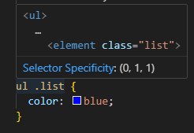
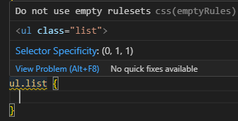

## Add JS

```javascript
<body onload="alert('inline')"></body>
```

- add inline js code

```javascript
<script type="text/javascript">alert("hello");</script>
```

- add block js code

```javascript
<script src="index.js" charset="utf-8"></script>
```

- external js file
- **place the code at the end of tag &lt;body&gt;, unlike CSS which should be loaded at the &lt;head&gt; tag**

<br>

---

## Introduction to DOM

Document Object Model: turn elements to a tree

Use HTML Tree Generator to generate a graph whose root is HTML:

- document: the whole page
- document.firstElementChild: the html code
- document.firstElementChild.firstElementChild: head tag
- document.firstElementChild.lastElementChild: body tag

</br>

```javascript
heading.innerHTML = "Good Bye"; // html between the <h1> tags are changed
heading.style.color = "red";
```

<br>

```javascript
<input type="checkbox">

document.querySelector("input").click(); //check box is selected
```

An object has properties and methods.

For example, an button

- properties: innerHTML, style, firstChild
- methods: click(), appendChild(), setAttribute()

<br>

---

## Selecting HTML Elements with Javascript

```html
<input type="checkbox" />

<button style=":active color:red;" class="btn">Click Me</button>

<ul id="lt">
  <li class="list">
    <a href="https://www.google.com">Google</a>
  </li>
  <li class="list">Second</li>
  <li class="list">Third</li>
</ul>
```

```javascript
document.getElementsByTagName("li"); // return a list

document.getElementsByTagName("li")[2].style.color = "purple"; // the third element becomes purple

document.getElementsByClassName("btn"); // style return a list

document.getElementsByClassName("btn")[0].innerHTML = "click again";

document.getElementById("lt");

document.querySelector("#list"); // also return only one element which is the first item
document.querySelectorAll("#list"); // return a list
```

about selector:

```
parent_selector selector

Selector1Selector2 -> apply for elements that there selectors are all true
```




<br>

---

## Change Styles of HTML Elements with JS

```javascript
element.style.style-properties = ...
```

- style: DOM Style Object
- style-properties: [link](https://www.w3schools.com/jsref/dom_obj_style.asp)

```javascript
document.querySelector("button").classList; // return the class list of the button element, which is "btn" in this case

document.querySelector("button").classList.add("invisible");
document.querySelector("button").classList.remove("invisible");
document.querySelector("button").classList.toggle("invisible");
```

- "invisible" is a class defined in the style.css

<br>

```html
<h1 id="title"><strong>hello</strong></h1>
```

```javascript
document.getElementById("title").innerHTML;
```

- return &lt;strong>hello &lt;/strong>

```javascript
document.getElementById("title").textContent;
```

- return hello

<br>

tag = element

**href, type, class, id: these are all arrtibutes**

```javascript
document.querySelector("#title").attributes;
```

- return a list which contains id

```javascript
document.querySelector("#title").getAttribute("id");
```

- return "title"

```javascript
document.querySelector("#title").setAttribute("id", "first-title");
```

- set id to "first-title"
