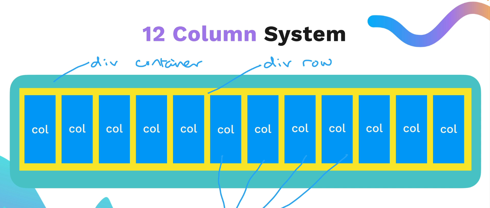
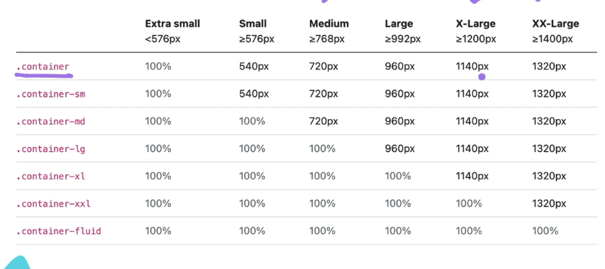
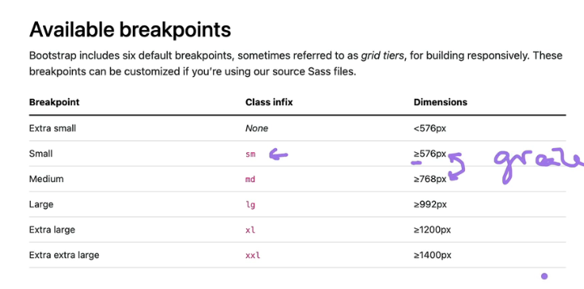

## Link

- put customer css style sheet under the bootstrap link to overides it.

```css
<link href="https://cdn.jsdelivr.net/npm/bootstrap@5.3.0/dist/css/bootstrap.min.css" rel="stylesheet" integrity="sha384-9ndCyUaIbzAi2FUVXJi0CjmCapSmO7SnpJef0486qhLnuZ2cdeRhO02iuK6FUUVM" crossorigin="anonymous">

<link href="./style.css" rel="stylesheet" />
```

## Layout

### 12 column System



### Container Size



- Small: mobile
- Medium/Large: ipad
- X-Large: desktop
- XX-Large: TV

What is container and how to use them?

- center the content instead of fullfilling the whole line

```
<div class="container">
  <!-- Content here -->
</div>
```

### Sized Columns

```
<div class="container">
    <div class="row">
        <div class="col-2">Hello</div>
        <div class="col-4">Hello</div>
        <div class="col-6">Hello</div>
    </div>
</div>
```

### Breakpoints



```
col-sm-2: The brakpoint is Small and it refers to 576px to 768px
```

- When the screen is between 576px-768px, it takes two columns. If nothing specified for screen above 768px, it still follows this rule.
- **The break point is actually 768px**

```
col-sm-12 col-md-8 col-xl-4
```

- on mobile, it will take 12 columns
- on ipad, it will take 8 columns
- on a laptop/desktop or things bingger, it will take 4 columns

### Spacing

```
mb-2
```

- margin-bottom-($spacer \* .5), in project $spacer is 8px
