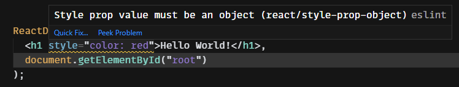
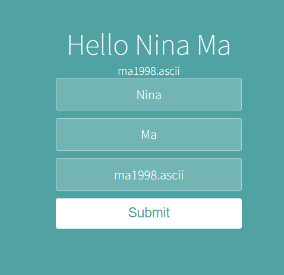

## React JSX

```jsx
ReactDOM.render(
  <h1>Hello {fName + " " + lName}!</h1>,
  document.getElementById("root")
);
```

- html must be wrapped in a single tag, like &lt;div>, it must have close tag, like &lt;img src="" alt="" />
- inside {}, it must be an expression instead of a statement. Statement performs actions, like if-else, but expression does not. It just resolves to a single value.

<br>

```javascript
<script src="../src/index.js" type="text/JSX"></script>
```

- index.js file is actually a JSX file that can include HTML-like code

<br>

```JSX
ReactDOM.render(
  <div>
    <h1 className="heading">My lucky number is {num}</h1>
  </div>,

  document.getElementById("root")
);
```

- className="heading": React HTML attributes, normally the camel case version of normal HTML attributes.

<br>

When adding inline style:


- style value must be a javascript object, which is {key1:value1, key2:value2}

```JSX
const customeStyle = {
    color: "red",
    fontSize: "20px"
}
 <h1 style={customeStyle}>Hello World!</h1>,
```

- css attributes are changed to camel case

Then we can change the style by simply accessing the key of the javascript object:

```JSX
customeStyle.color = "blue"
```

<br>

## React Component

Heading.jsx:

```JSX
import React from "react";

function Heading() {
    return (<h1>My Favourite Foods</h1>);
}

export default Heading; // no ()
```

Tu use this component:

```jsx
import Heading from "./Heading";

<Heading />;
```

<br>

```jsx
const pi
function doublePi()
function triplePi

export default pi;
export {doublePi, triplePi};
```

```jsx
import PI, { doublePi, triplePi } from "./file_above";
```

- for default export, the name does not matter

<br>

## React App

```
npx create-react-app app-name
```

- create react project in the current directory

```
cd my-app
npm start
```

- run projectcd

<br>

How to add react dependencies for anexisting project?

- cd the project directory
- run npm install
- run npm start -> http://localhost:3000/
- Ctrl + C: terminate the project

<br>

Difference between customized elements and html elements

- &lt;Header> : starts with a capitalized letter, this is a customized element
- &lt;header>: this is a html element

<br>

## React Props

- To send props into a component, use the same syntax as HTML attributes:

```jsx
const myElement = <Car brand="Ford" />;

function Car(props) {
  return <h2>I am a {props.brand}!</h2>;
}
```

<br>

## React Debug

- use the extension "React Developer Tools"
- If it is organge: development version. If it is blue: deployed version (airbnb).

<br>

## Mapping Dta to Components

```jsx
function CreateCard(contact) {
  return (
    <Card
      key={contact.id} // each component better has a unique key as property
      name={contact.name}
      img={contact.imgURL}
      tel={contact.phone}
      email={contact.email}
    />
  );
}

{
  contacts.map(CreateCard);
} // contacts is an Array
```

- but key property is special, it can not be accessed
- contacts.js also need to be export

<br>

## Map, Filter, Reduce

Array map function:

```javascript
const numbers = [65, 44, 12, 4];
const newArr = numbers.map(myFunction);

function myFunction(num) {
  return num * 10;
}
```

- {numbers.map(myFunction)} -> it returns a array, React will render the arr automatically

<br>

Array filter function:

```javascript
const numbers = [65, 44, 12, 4];

const newArr = numbers.filter(myFunction); //[65, 44]

function myFunction(num) {
  return num > 20; // return true/false
}
```

<br>

Array Reduce Function

```javascript
const numbers = [65, 44, 12, 4];
var sum = numbers.reduce(function (accumulator, currentNumber) {
  return accumulator + currentNumber;
});
```

<br>

Array Find Function

- find the first item that matches from an array

```javascript
const numbers = [65, 44, 12, 4];

numbers.find(function (num) {
  return num < 15;
}); // return 12

numbers.findIndex(function (num) {
  return num < 15;
}); // return 2, the index of 12
```

<br>

## ES6 Arrow Functions

```jsx
numbers.findIndex(function (num) {
  return num < 15;
});

numbers.findIndex((num) => {
  return num < 15;
});

numbers.findIndex((num) => num < 15);
```

<br>

## Ternary Operator

```jsx
{CONDITION ? DO IF TRUE : DO IF FALSE}

{ isLoggedIn ? <h1>Hello</h1> : <Login /> }
```

- It is a expression so it can be inside the { }

<br>

```jsx
{
  CONDITION && EXPRESSION;
}
```

- only execute the expression when the condition is true

<br>

## State in React

```jsx
function App() {
  var isDone = true;

  const strikeThrough = { textDecoration: "line-through" }; // js object

  return <p style={ isDone ? strikeThrough }> Buy Milk</p>;
}
```

- declarative programming: how the ui should look under different conditions.

```jsx
document.getElementById("root").style.textDecoration = "line-through";
```

<br>

## React Hooks

You must use hook inside a function that renders a component.

```jsx
import React, { useState } from "react";

function App() {
  const [count, setCount] = useState(0);

  function increase() {
    setCount(count + 1);
  }

  return (
    <div className="container">
      <h1>{count}</h1>
      <button onClick={increase}>+</button>
    </div>
  );
}
```

- useState hook is imported from React.
- Its para is the initial value (of state variable). It returns a state variable and its corresponding updater function setCount.

<br>

## Destructure

```jsx
// animals
const animals = [
  { name: "cat", sound: "meow" },
  { name: "dog", sound: "woof" },
];

// destructure animals, which is an array
const [myCat, myDog] = animals; // for array, name does not have to be the same

// destructure myCat, which is a object
const { name, sound } = myCat;
// const { name: catName, sound: catSound } = myCat;
const { name = "Fluffy", sound = "Purr" } = myCat; // the default value
```

<br>

```jsx
const animals = [
  { name: "cat", sound: "meow", feedingRequirements: { food: 2, water: 3 } },
  { name: "dog", sound: "woof" },
];

const [myCat, myDog] = animals;

const {
  name,
  sound,
  feedingRequirements: { food, water },
} = myCat;

const {
  feedingRequirements: { food, water },
} = myCat; // I can also just do one
```

<br>

## React Event Handling

HTML event attributes
<br>

```jsx
return <button style={{ backgroundColor: "black" }}>Submit</button>;

or;

const cus_style = {
  backgroundColor: "black",
};
return <button style={cus_style}>Submit</button>;
```

<br>

```jsx
<button style={{ backgroundColor: isMousedOver ? "black" : "white" }}>
```

<br>

## React Forms

- "event" as react event parameter, can contain a lot of information.

```jsx
const [name, setName] = useState("");
function handleChange(event) {
  setName(event.target.value);
}

<input
  onChange={handleChange}
  type="text"
  placeholder="What's your name?"
  value={name}
/>;
```

<br>

## Class Components vs Functional Components

<br>

## Changing Complex State

```jsx
function App() {
  const [contact, setContact] = useState({
    fName: "",
    lName: "",
    email: "",
  });

  function handleChange(event) {
    const { name, value } = event.target;

    setContact((prevValue) => {
      if (name === "fName") {
        return {
          fName: value,
          lName: prevValue.lName,
          email: prevValue.email,
        };
      } else if (name === "lName") {
        return {
          fName: prevValue.fName,
          lName: value,
          email: prevValue.email,
        };
      } else if (name === "email") {
        return {
          fName: prevValue.fName,
          lName: prevValue.lName,
          email: value,
        };
      }
    });
  }

  return (
    <div className="container">
      <h1>
        Hello {contact.fName} {contact.lName}
      </h1>
      <p>{contact.email}</p>
      <form>
        <input
          onChange={handleChange}
          value={contact.fName}
          name="fName"
          placeholder="First Name"
        />
        <input
          onChange={handleChange}
          value={contact.lName}
          name="lName"
          placeholder="Last Name"
        />
        <input
          onChange={handleChange}
          value={contact.email}
          name="email"
          placeholder="Email"
        />
        <button>Submit</button>
      </form>
    </div>
  );
}

export default App;
```



<br>

## Spread Operator

```jsx
const citrus = ["Lime", "Lemon", "Orange"];
const fruits = ["Apple", "Banana", "Coconut", ...citrus];
// now fruits is ["Apple", "Banana", "Coconut", "Lime", "Lemon", "Orange"];

const fullName = {
  fName: "James",
  lName: "Bond",
};

const user = {
  fullName,
  id: 1,
  username: "jamesbond007",
};
/* just user is
{
  fullName: Object,
  id: 1,
  username: "jamesbond007"
}*/

const user = {
  ...fullName,
  id: 1,
  username: "jamesbond007",
};
/* Now user is:
{
  fName: "James",
  lName: "Bond"
  id: 1,
  username: "jamesbond007"
}
*/
```

<br>

- continued from the code within Changing Complex State

```jsx
const { name, value } = event.target; // name is the "name" property, which is "fName", "lName", or "email"

setContact((preValue) => {
  return {
    ...preValue,
    [name]: value, // if you write it in name: value, name will become a literal String instead of a variable
  };
});
```

<br>

## Managing a Component Tree

```jsx
<li onClick={() => {props.onChecked(props.id);}} >

<li onClick={props.onChecked(props.id)}
} >
```

- the first one: it passes a function to onClick. The function only gets trigured when click event happens.
- the second one: the function gets trigured immediately.

<br>

## Material UI

Add dependencies:

- go to material ui website and npm install dependencies:

```
npm install @mui/material @emotion/react @emotion/styled
```
